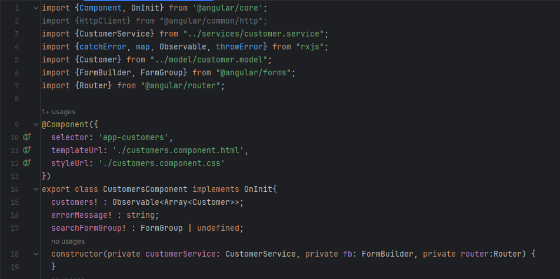
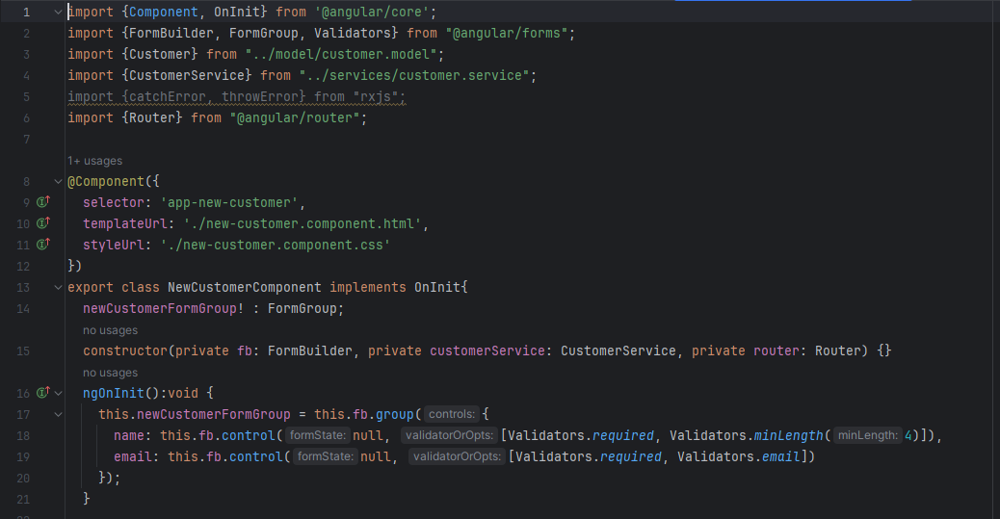

<h2>Compte Rendu Projet Banking - FrontEnd</h2>
<h2>Part 1 :</h2>
<h3>1. Créations des Components</h3>
<h4>Customers :</h4>
customers.component.ts

customers.component.html

<h4>Navbar :</h4>
navbar.component.ts 

navbar.component.html

<h4>New Customer : </h4>
new-customer.component.ts 

new-customer.component.html

<h4>Modification app : </h4>
app.component.html 

<h3>2. Créations des Models</h3>
<h4>Customers :</h4>

<h3>3. Créations des Services</h3>
<h4>Customers :</h4>

<h3>4. Routing</h3>
<h4>app-routing.module.ts</h4>

<h3>4. Résultat</h3>
<h4>Navbar / Customer :</h4>

<h4>Search Customer :</h4>

<h4>New Customer :</h4>

<h4>Delete Customer :</h4>

<h2>Part 2 :</h2>
<h3>1. Ajout des Components</h3>
<h4>Accounts :</h4>
accounts.component.ts

customers.component.html

<h4>Customer-Account :</h4>
customer-accounts.component.ts

customer-accounts.component.html

<h3>2. Ajout du Model</h3>
<h4>Accounts :</h4>

<h3>3. Ajout d'un Service</h3>
<h4>Accounts :</h4>

<h3>4. Routing customer-accounts </h3>
<h4>app-routing.module.ts</h4>

<h3>4. Résultat</h3>
<h4>Search Account :</h4>

<h4>Pagination :</h4>

<h4>Débit :</h4>

<h4>Crédit :</h4>

<h4>Transfer :</h4>

